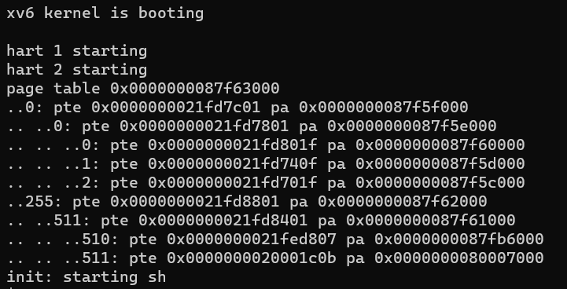
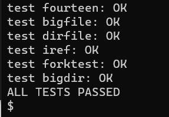
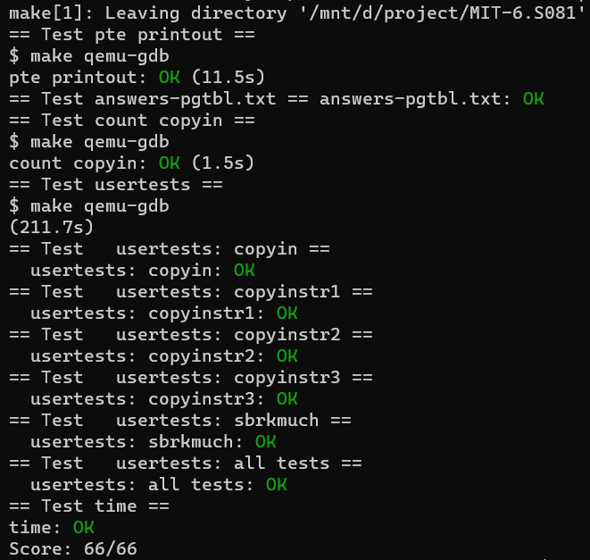

# lab3: pgtbl

# 1. Print a page table

本实验主要是实现一个打印页表内容的函数， 首先根据提示在`exec.c`中的`return argc`之前插入`if(p->pid==1) vmprint(p->pagetable)`

然后看一下*kernel/vm.c*里面的`freewalk`方法，主要的代码如下：

```c
// Recursively free page-table pages.
// All leaf mappings must already have been removed.
void
freewalk(pagetable_t pagetable)
{
  // there are 2^9 = 512 PTEs in a page table.
  for(int i = 0; i < 512; i++){
    pte_t pte = pagetable[i];
    if((pte & PTE_V) && (pte & (PTE_R|PTE_W|PTE_X)) == 0){
      // this PTE points to a lower-level page table.
      uint64 child = PTE2PA(pte);
      freewalk((pagetable_t)child);
      pagetable[i] = 0;
    } else if(pte & PTE_V){
      panic("freewalk: leaf");
    }
  }
  kfree((void*)pagetable);
}
```

它首先会遍历整个页表。当遇到有效的页表项并且不在最后一层的时候，它会递归调用。`PTE_V`是用来判断页表项是否有效，而`(pte & (PTE_R|PTE_W|PTE_X)) == 0`则是用来判断是否不在最后一层。因为最后一层页表中页表项中W位，R位，X位起码有一位会被设置为1。注释里面说所有最后一层的页表项已经被释放了，所以遇到不符合的情况就`panic("freewalk: leaf")`。

那么，根据`freewalk`，我们可以写下递归函数。对于每一个有效的页表项都打印其和其子项的内容。如果不是最后一层的页表就继续递归。通过`level`来控制前缀`..`的数量。

```c
/**
 * @param pagetable 所要打印的页表
 * @param level 页表的层级
 */
void
_vmprint(pagetable_t pagetable, int level){
  // there are 2^9 = 512 PTEs in a page table.
  for(int i = 0; i < 512; i++){
    pte_t pte = pagetable[i];
    // PTE_V is a flag for whether the page table is valid
    if(pte & PTE_V){
      for (int j = 0; j < level; j++){
        if (j) printf(" ");
        printf("..");
      }
      uint64 child = PTE2PA(pte);
      printf("%d: pte %p pa %p\n", i, pte, child);
      if((pte & (PTE_R|PTE_W|PTE_X)) == 0){
        // this PTE points to a lower-level page table.
        _vmprint((pagetable_t)child, level + 1);
      }
    }
  }
}

/**
 * @brief vmprint 打印页表
 * @param pagetable 所要打印的页表
 */
void
vmprint(pagetable_t pagetable){
  printf("page table %p\n", pagetable);
  _vmprint(pagetable, 1);
}
```

最后记得加到*kernel/defs.h*里面。

```c
int             copyin(pagetable_t, char *, uint64, uint64);
int             copyinstr(pagetable_t, char *, uint64, uint64);
void            vmprint(pagetable_t);
```

重新跑一下`make qemu`，可以看到下面的输出：




# 2. A kernel page table per process

本实验主要是让每个进程都有自己的内核页表，这样在内核中执行时使用它自己的内核页表的副本。

**(1)**. 首先给*kernel/proc.h*里面的`struct proc`加上内核页表的字段。

```c
uint64 kstack;               // Virtual address of kernel stack
uint64 sz;                   // Size of process memory (bytes)
pagetable_t pagetable;       // User page table
pagetable_t kernelpt;      // 进程的内核页表
struct trapframe *trapframe; // data page for trampoline.S
```

**(2)**. 在`vm.c`中添加新的方法`proc_kpt_init`，该方法用于在`allocproc` 中初始化进程的内核页表。这个函数还需要一个辅助函数`uvmmap`，该函数和`kvmmap`方法几乎一致，不同的是`kvmmap`是对Xv6的内核页表进行映射，而`uvmmap`将用于进程的内核页表进行映射。

```c
// Just follow the kvmmap on vm.c
void
uvmmap(pagetable_t pagetable, uint64 va, uint64 pa, uint64 sz, int perm)
{
  if(mappages(pagetable, va, sz, pa, perm) != 0)
    panic("uvmmap");
}

// Create a kernel page table for the process
pagetable_t
proc_kpt_init(){
  pagetable_t kernelpt = uvmcreate();
  if (kernelpt == 0) return 0;
  uvmmap(kernelpt, UART0, UART0, PGSIZE, PTE_R | PTE_W);
  uvmmap(kernelpt, VIRTIO0, VIRTIO0, PGSIZE, PTE_R | PTE_W);
  uvmmap(kernelpt, CLINT, CLINT, 0x10000, PTE_R | PTE_W);
  uvmmap(kernelpt, PLIC, PLIC, 0x400000, PTE_R | PTE_W);
  uvmmap(kernelpt, KERNBASE, KERNBASE, (uint64)etext-KERNBASE, PTE_R | PTE_X);
  uvmmap(kernelpt, (uint64)etext, (uint64)etext, PHYSTOP-(uint64)etext, PTE_R | PTE_W);
  uvmmap(kernelpt, TRAMPOLINE, (uint64)trampoline, PGSIZE, PTE_R | PTE_X);
  return kernelpt;
}
```

然后在*kernel/proc.c*里面的`allocproc`调用。

```c
...
// An empty user page table.
p->pagetable = proc_pagetable(p);
if(p->pagetable == 0){
  freeproc(p);
  release(&p->lock);
  return 0;
}

// Init the kernal page table
p->kernelpt = proc_kpt_init();
if(p->kernelpt == 0){
  freeproc(p);
  release(&p->lock);
  return 0;
}
...
```

**(3)**. 根据提示，为了确保每一个进程的内核页表都关于该进程的内核栈有一个映射。我们需要将`procinit`方法中相关的代码迁移到`allocproc`方法中。很明显就是下面这段代码，将其剪切到上述内核页表初始化的代码后。

```
// Allocate a page for the process's kernel stack.
// Map it high in memory, followed by an invalid
// guard page.
char *pa = kalloc();
if(pa == 0)
  panic("kalloc");
uint64 va = KSTACK((int) (p - proc));
uvmmap(p->kernelpt, va, (uint64)pa, PGSIZE, PTE_R | PTE_W);
p->kstack = va;
```

**(4)**. 我们需要修改`scheduler()`来加载进程的内核页表到SATP寄存器。提示里面请求阅读`kvminithart()`。

```c
// Switch h/w page table register to the kernel's page table,
// and enable paging.
void
kvminithart()
{
  w_satp(MAKE_SATP(kernel_pagetable));
  sfence_vma();
}
```

`kvminithart`是用于原先的内核页表，我们将进程的内核页表传进去就可以。在*vm.c*里面添加一个新方法`proc_inithart`。

```c
// Store kernel page table to SATP register
void
proc_inithart(pagetable_t kpt){
  w_satp(MAKE_SATP(kpt));
  sfence_vma();
}
```

然后在`scheduler()`内调用即可，但在结束的时候，需要切换回原先的`kernel_pagetable`。直接调用调用上面的`kvminithart()`就能把Xv6的内核页表加载回去。

```c
...
p->state = RUNNING;
c->proc = p;

// Store the kernal page table into the SATP
proc_inithart(p->kernelpt);

swtch(&c->context, &p->context);

// Come back to the global kernel page table
kvminithart();
...
```

**(5)**. 在`freeproc`中释放一个进程的内核页表。首先释放页表内的内核栈，调用`uvmunmap`可以解除映射，最后的一个参数（`do_free`）为一的时候，会释放实际内存。

```c
// free the kernel stack in the RAM
uvmunmap(p->kernelpt, p->kstack, 1, 1);
p->kstack = 0;
```

然后释放进程的内核页表，先在*kernel/proc.c*里面添加一个方法`proc_freekernelpt`。如下，历遍整个内核页表，然后将所有有效的页表项清空为零。如果这个页表项不在最后一层的页表上，需要继续进行递归。

```c
void
proc_freekernelpt(pagetable_t kernelpt)
{
  // similar to the freewalk method
  // there are 2^9 = 512 PTEs in a page table.
  for(int i = 0; i < 512; i++){
    pte_t pte = kernelpt[i];
    if(pte & PTE_V){
      kernelpt[i] = 0;
      if ((pte & (PTE_R|PTE_W|PTE_X)) == 0){
        uint64 child = PTE2PA(pte);
        proc_freekernelpt((pagetable_t)child);
      }
    }
  }
  kfree((void*)kernelpt);
}
```

**(6)**. 将需要的函数定义添加到 `kernel/defs.h` 中

```c
// vm.c
void            kvminit(void);
pagetable_t     proc_kpt_init(void); // 用于内核页表的初始化
void            kvminithart(void); 
void            proc_inithart(pagetable_t); // 将进程的内核页表保存到SATP寄存器
...
```

**(7)**. 修改`vm.c`中的`kvmpa`，将原先的`kernel_pagetable`改成`myproc()->kernelpt`，使用进程的内核页表。

```c
#include "spinlock.h" 
#include "proc.h"

uint64
kvmpa(uint64 va)
{
  uint64 off = va % PGSIZE;
  pte_t *pte;
  uint64 pa;
  
  pte = walk(myproc()->kernelpt, va, 0); // 修改这里
  if(pte == 0)
    panic("kvmpa");
  if((*pte & PTE_V) == 0)
    panic("kvmpa");
  pa = PTE2PA(*pte);
  return pa+off;
}
```

**(8)**. 测试一下我们的代码，先跑起`qemu`，然后跑一下`usertests`。这部分耗时会比较长。

```bash
$ make qemu
> usertests
```

得到以下输出：




# 3. Simplify `copyin/copyinstr`

本实验是实现将用户空间的映射添加到每个进程的内核页表，将进程的页表复制一份到进程的内核页表就好。

首先添加复制函数。需要注意的是，在内核模式下，无法访问设置了`PTE_U`的页面，所以我们要将其移除。

```c
void
u2kvmcopy(pagetable_t pagetable, pagetable_t kernelpt, uint64 oldsz, uint64 newsz){
  pte_t *pte_from, *pte_to;
  oldsz = PGROUNDUP(oldsz);
  for (uint64 i = oldsz; i < newsz; i += PGSIZE){
    if((pte_from = walk(pagetable, i, 0)) == 0)
      panic("u2kvmcopy: src pte does not exist");
    if((pte_to = walk(kernelpt, i, 1)) == 0)
      panic("u2kvmcopy: pte walk failed");
    uint64 pa = PTE2PA(*pte_from);
    uint flags = (PTE_FLAGS(*pte_from)) & (~PTE_U);
    *pte_to = PA2PTE(pa) | flags;
  }
}
```

然后在内核更改进程的用户映射的每一处 （`fork()`, `exec()`, 和`sbrk()`），都复制一份到进程的内核页表。

- `exec()`：

```c
int
exec(char *path, char **argv){
  ...
  sp = sz;
  stackbase = sp - PGSIZE;

  // 添加复制逻辑
  u2kvmcopy(pagetable, p->kernelpt, 0, sz);

  // Push argument strings, prepare rest of stack in ustack.
  for(argc = 0; argv[argc]; argc++) {
  ...
}
```

- `fork()`:

```c
int
fork(void){
  ...
  // Copy user memory from parent to child.
  if(uvmcopy(p->pagetable, np->pagetable, p->sz) < 0){
    freeproc(np);
    release(&np->lock);
    return -1;
  }
  np->sz = p->sz;
  ...
  // 复制到新进程的内核页表
  u2kvmcopy(np->pagetable, np->kernelpt, 0, np->sz);
  ...
}
```

- `sbrk()`， 在*kernel/sysproc.c*里面找到`sys_sbrk(void)`，可以知道只有`growproc`是负责将用户内存增加或缩小 n 个字节。以防止用户进程增长到超过`PLIC`的地址，我们需要给它加个限制。

```c
int
growproc(int n)
{
  uint sz;
  struct proc *p = myproc();

  sz = p->sz;
  if(n > 0){
    // 加上PLIC限制
    if (PGROUNDUP(sz + n) >= PLIC){
      return -1;
    }
    if((sz = uvmalloc(p->pagetable, sz, sz + n)) == 0) {
      return -1;
    }
    // 复制一份到内核页表
    u2kvmcopy(p->pagetable, p->kernelpt, sz - n, sz);
  } else if(n < 0){
    sz = uvmdealloc(p->pagetable, sz, sz + n);
  }
  p->sz = sz;
  return 0;
}
```

然后替换掉原有的`copyin()`和`copyinstr()`

```c
// Copy from user to kernel.
// Copy len bytes to dst from virtual address srcva in a given page table.
// Return 0 on success, -1 on error.
int
copyin(pagetable_t pagetable, char *dst, uint64 srcva, uint64 len)
{
  return copyin_new(pagetable, dst, srcva, len);
}

// Copy a null-terminated string from user to kernel.
// Copy bytes to dst from virtual address srcva in a given page table,
// until a '\0', or max.
// Return 0 on success, -1 on error.
int
copyinstr(pagetable_t pagetable, char *dst, uint64 srcva, uint64 max)
{
  return copyinstr_new(pagetable, dst, srcva, max);
}
```

并且添加到 `kernel/defs.h` 中

```c
// vmcopyin.c
int             copyin_new(pagetable_t, char *, uint64, uint64);
int             copyinstr_new(pagetable_t, char *, uint64, uint64);
```

最后跑一下最终测试：

```bash
$ make grade
```

**注**：这里笔者加了*time.txt*和*answers-pgtbl.txt*来通过全部测试，不影响上述的代码实现。



