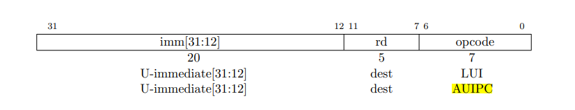
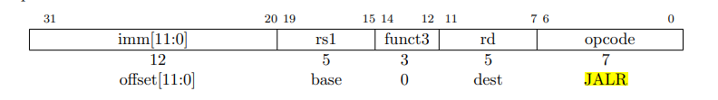

# Lab4: Traps

# 1. RISC-V assembly

**(1)**.  在a0-a7中存放参数，13存放在a2中 

**(2)**.  在C代码中，main调用f，f调用g。而在生成的汇编中，main函数进行了内联优化处理。

从代码`li a1,12`可以看出，main直接计算出了结果并储存 

**(3)**. 在`0x630`

**(4)**. `auipc`(Add Upper Immediate to PC)：`auipc rd imm`，将高位立即数加到PC上，从下面的指令格式可以看出，该指令将20位的立即数左移12位之后（右侧补0）加上PC的值，将结果保存到dest位置，图中为`rd`寄存器



下面来看`jalr` (jump and link register)：`jalr rd, offset(rs1)`跳转并链接寄存器。jalr指令会将当前PC+4保存在rd中，然后跳转到指定的偏移地址`offset(rs1)`。



来看XV6的代码：

```asm
  30: 00000097       auipc ra,0x0
  34: 600080e7       jalr  1536(ra) # 630 <printf>
```

第一行代码：`00000097H=00...0 0000 1001 0111B`，对比指令格式，可见imm=0，dest=00001，opcode=0010111，对比汇编指令可知，auipc的操作码是0010111，ra寄存器代码是00001。这行代码将0x0左移12位（还是0x0）加到PC（当前为0x30）上并存入ra中，即ra中保存的是0x30

第2行代码：`600080e7H=0110 0...0 1000 0000 1110 0111B`，可见imm=0110 0000 0000，rs1=00001，funct3=000，rd=00001，opcode=1100111，rs1和rd的知识码都是00001，即都为寄存器`ra`。这对比jalr的标准格式有所不同，可能是此两处使用寄存器相同时，汇编中可以省略`rd`部分。

ra中保存的是0x30，加上0x600后为0x630，即`printf`的地址，执行此行代码后，将跳转到printf函数执行，并将PC+4=0X34+0X4=0X38保存到`ra`中，供之后返回使用。

**(5)**. 57616=0xE110，0x00646c72小端存储为72-6c-64-00，对照ASCII码表

 72:r 6c:l 64:d 00:充当字符串结尾标识

 因此输出为：HE110 World

 若为大端存储，i应改为0x726c6400，不需改变57616 

**(6)**. 原本需要两个参数，却只传入了一个，因此y=后面打印的结果取决于之前a2中保存的数据 

# 2. Backtrace

这个函数就是实现曾经调用函数地址的回溯，这个功能在日常的编程中也经常见到，编译器报错时就是类似的逻辑，只不过题目的要求较为简单，只用打印程序地址，而实际的报错中往往打印程序文件名，函数名以及行号等信息（最后的可选练习就是实现这样的功能）。

```c
/**
 * @brief backtrace 回溯函数调用的返回地址
 */
void
backtrace(void) {
  printf("backtrace:\n");
  // 读取当前帧指针
  uint64 fp = r_fp();
  while (PGROUNDUP(fp) - PGROUNDDOWN(fp) == PGSIZE) {
    // 返回地址保存在-8偏移的位置
    uint64 ret_addr = *(uint64*)(fp - 8);
    printf("%p\n", ret_addr);
    // 前一个帧指针保存在-16偏移的位置
    fp = *(uint64*)(fp - 16);
  }
}
```

​        根据提示：返回地址位于栈帧帧指针的固定偏移(-8)位置，并且保存的帧指针位于帧指针的固定偏移(-16)位置。先使用`r_fp()`读取当前的帧指针，然后读出返回地址并打印，再将`fp`定位到前一个帧指针的位置继续读取即可。

根据提示：XV6在内核中以页面对齐的地址为每个栈分配一个页面。使用`PGROUNDUP(fp) - PGROUNDDOWN(fp) == PGSIZE`判断当前的`fp`是否被分配了一个页面来终止循环。

# 3. Alarm

这项练习要实现定期的警报。首先是要通过`test0`，如何调用处理程序是主要的问题。程序计数器的过程是这样的：

1. `ecall`指令中将PC保存到SEPC
2. 在`usertrap`中将SEPC保存到`p->trapframe->epc`
3. `p->trapframe->epc`加4指向下一条指令
4. 执行系统调用
5. 在`usertrapret`中将SEPC改写为`p->trapframe->epc`中的值
6. 在`sret`中将PC设置为SEPC的值

可见执行系统调用后返回到用户空间继续执行的指令地址是由`p->trapframe->epc`决定的，因此在`usertrap`中主要就是完成它的设置工作。

**(1)**. 在`struct proc`中增加字段，同时记得在`allocproc`中将它们初始化为0，并在`freeproc`中也设为0

```c
int alarm_interval;          // 报警间隔
void (*alarm_handler)();     // 报警处理函数
int ticks_count;             // 两次报警间的滴答计数
```

**(2)**. 在`sys_sigalarm`中读取参数

```c
uint64
sys_sigalarm(void) {
  if(argint(0, &myproc()->alarm_interval) < 0 ||
    argaddr(1, (uint64*)&myproc()->alarm_handler) < 0)
    return -1;

  return 0;
}
```

**(3)**. 修改usertrap()

```c
// give up the CPU if this is a timer interrupt.
if(which_dev == 2) {
    if(++p->ticks_count == p->alarm_interval) {
        // 更改陷阱帧中保留的程序计数器
        p->trapframe->epc = (uint64)p->alarm_handler;
        p->ticks_count = 0;
    }
    yield();
}
```

接下来要通过`test1`和`test2`，要解决的主要问题是寄存器保存恢复和防止重复执行的问题。考虑一下没有alarm时运行的大致过程

1. 进入内核空间，保存用户寄存器到进程陷阱帧
2. 陷阱处理过程
3. 恢复用户寄存器，返回用户空间

而当添加了alarm后，变成了以下过程

1. 进入内核空间，保存用户寄存器到进程陷阱帧
2. 陷阱处理过程
3. 恢复用户寄存器，返回用户空间，但此时返回的并不是进入陷阱时的程序地址，而是处理函数`handler`的地址，而`handler`可能会改变用户寄存器

因此我们要在`usertrap`中再次保存用户寄存器，当`handler`调用`sigreturn`时将其恢复，并且要防止在`handler`执行过程中重复调用，过程如下

**(1)**. 再在`struct proc`中新增两个字段

```c
int is_alarming;                    // 是否正在执行告警处理函数
struct trapframe* alarm_trapframe;  // 告警陷阱帧
```

**(2)**. 在allocproc和freeproc中设定好相关分配，回收内存的代码

```c
/**
 * allocproc.c
 */
// 初始化告警字段
if((p->alarm_trapframe = (struct trapframe*)kalloc()) == 0) {
    freeproc(p);
    release(&p->lock);
    return 0;
}
p->is_alarming = 0;
p->alarm_interval = 0;
p->alarm_handler = 0;
p->ticks_count = 0;

/**
 * freeproc.c
 */
if(p->alarm_trapframe)
    kfree((void*)p->alarm_trapframe);
p->alarm_trapframe = 0;
p->is_alarming = 0;
p->alarm_interval = 0;
p->alarm_handler = 0;
p->ticks_count = 0;
```

**(3)**. 更改usertrap函数，保存进程陷阱帧`p->trapframe`到`p->alarm_trapframe`

```c
// give up the CPU if this is a timer interrupt.
if(which_dev == 2) {
  if(p->alarm_interval != 0 && ++p->ticks_count == p->alarm_interval && p->is_alarming == 0) {
    // 保存寄存器内容
    memmove(p->alarm_trapframe, p->trapframe, sizeof(struct trapframe));
    // 更改陷阱帧中保留的程序计数器，注意一定要在保存寄存器内容后再设置epc
    p->trapframe->epc = (uint64)p->alarm_handler;
    p->ticks_count = 0;
    p->is_alarming = 1;
  }
  yield();
}
```

**(4)**. 更改`sys_sigreturn`，恢复陷阱帧

```c
uint64
sys_sigreturn(void) {
  memmove(myproc()->trapframe, myproc()->alarm_trapframe, sizeof(struct trapframe));
  myproc()->is_alarming = 0;
  return 0;
}
```