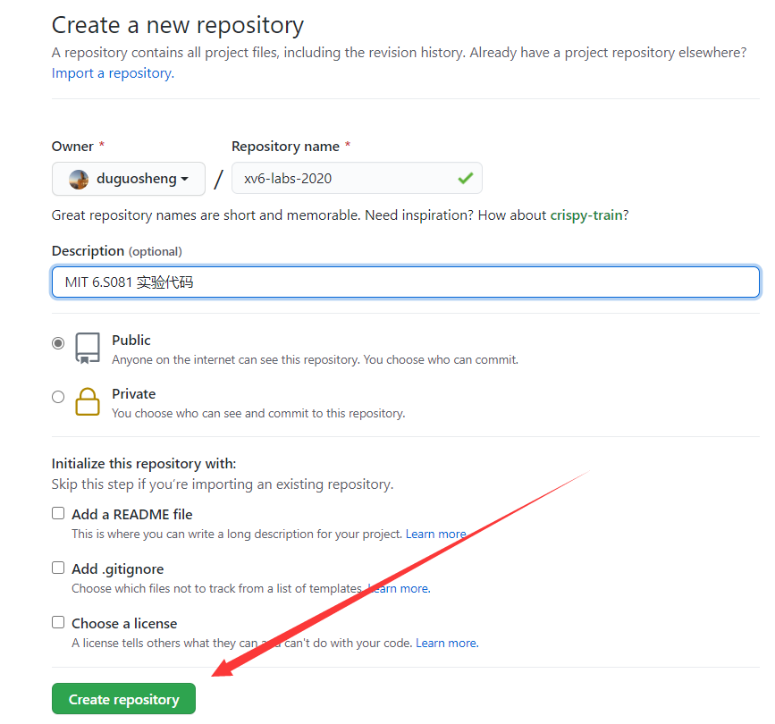
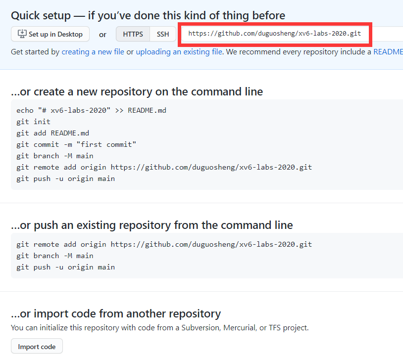
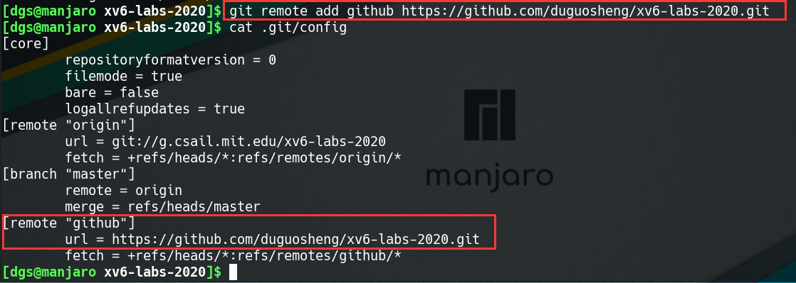

# 将实验代码提交到github

> [!DANGER]
> MIT 6.S081 这门课程每个lab对应一个git分支，所以请不要擅自将***.git***目录删除或更改origin指向的仓库地址

(1).  **首先将mit的实验代码克隆到本地**

```bash
git clone git://g.csail.mit.edu/xv6-labs-2020
```


(2). **在github创建一个新的空仓库**

创建完成后会有提示代码，请**不要**根据提示代码操作，并且记下右图中红色标注的仓库地址




(3). **添加git仓库地址**

查看本地仓库的git配置文件，可以看到***origin***主机名下已经有了对应的上游仓库地址

```bash
cd xv6-labs-2020/
cat .git/config
```


因此我们不要使用***origin***，可以使用其他主机名对应到github仓库，例如，我使用***github***

```bash
git remote add github 你的仓库地址
cat .git/config
```




(4). **`git push`命令**

- **功能**：`git push`命令用于从将本地的分支版本上传到远程并合并。
- **命令格式**：

```bash
git push <远程主机名> <本地分支名>:<远程分支名>
```

如果本地分支名与远程分支名相同，则可以省略冒号：

```bash
git push <远程主机名> <本地分支名>
```

更多用法请自行搜索


(5). **将实验代码推送github仓库**

例如：将实验1用到的***util***分支推送到github

```bash
git checkout util
git push github util:util
```

需要你输入账户密码，提交就成功了

其他实验仓库的提交同理


(6). **xv6实验git分支建议**

建议是每个实验创建一个测试分支，例如对于***util***来说

```bash
git checkout util         # 切换到util分支
git checkout -b util_test # 建立并切换到util的测试分支
```

当你在***util_test***分支中每测试通过一个作业，请提交（`git commit`）你的代码，并将所做的修改合并（`git merge`）到***util***中，然后提交（`git push`）到github

```bash
git add .
git commit -m "完成了第一个作业"
git checkout util
git merge util_test
git push github util:util
```


(7). **其他**

你还可以添加gitee，防止github有时无法访问的问题