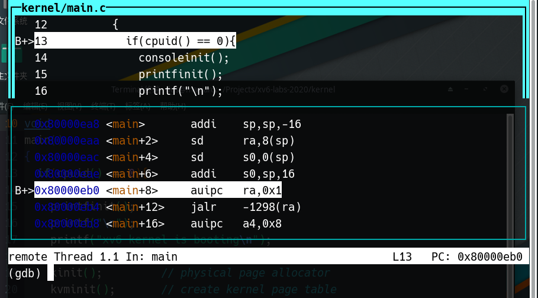

# 使用GUN Debugger

# 6.828的GDB

- 我们提供一个名为**.gdbinit**的文件，自动设置GDB以用于QEMU
  - 必须在lab或xv6目录中运行GDB
  - 编辑***~/.gdbinit***以执行其他需要的GDB初始化

- 以带有或不带有GDB的方式使用`make`指令启动QEMU
  - 带有GDB：运行`make qemu[-nox]-gdb`，然后在第二个Shell中启动GDB（`iscv64-linux-gnu-gdb`）
  - 如果以单核方式启动，则使用`make CPUS=1 qemu-gdb`
  - 不带有GDB：当不需要GDB时使用`make qemu[-nox]`命令


# GDB命令

- 当你不知道某个命令怎么使用时，运行`help <命令名称>`来获取帮助
- 在无歧义的情况下，所有命令都可以被简写

```
c`=`co`=`cont`=`continue
```

- 一些额外的简写已经被定义,例如

```
s`=`step` 以及 `si`=`stepi
```


## 单步调试

- `step`一次运行一行代码。当有函数调用时，它将步进到被调用的对象函数。
- `next`也是一次运行一行代码。但当有函数调用时，它不会进入该函数。
- `stepi`和`nexti`对于汇编指令是单步调试。

所有命令都可以采用一个数字参数来指定重复执行的次数。按回车键将重复上一个命令。


## 运行调试

- `continue`运行代码，直到遇到断点或使用`<Ctrl-c>`中断它
- `finish`运行代码，直到当前函数返回
- `advance <location>`运行代码，直到指令指针到达指定位置


## 断点

- `break <location>`在指定的位置设置断点。
	位置可以是内存地址(`*0x7c00`)或名称(`monbacktrace`，`monitor.c:71`)

- 如需修改断点请使用`delete`，`disable`，`enable`

## 条件断点

- `break <location> if <condition>`在指定位置设置断点，但仅在满足条件时中断。
- `cond <number> <condition>`在现有断点上添加条件。

## 监视点

类似于断点，但条件更为复杂。

- `watch <expression>`每当表达式的值更改时，将停止执行
- `watch -l <address>`每当指定内存地址的内容发生变化时，就会停止执行。
  - 命令`wa var`和`wa -l &var`有什么不同呢?
- `rwatch [-l] <expression>`将在读取表达式的值时停止执行。

## 检查命令

- `x`以您指定格式（`x/x`表示十六进制，`x/i`表示汇编，等等）打印内存的原始内容。
- `print`计算一个C表达式并将结果以合适的类型打印。它通常比`x`更有用
- 使用`p *((struct elfhdr *) 0x10000)`的输出比`x/13x 0x10000`的输出好得多

## 其他检查命令

- `info registers`打印每个寄存器的值
- `info frame`打印当前栈帧
- `list <location>`在指定位置打印函数的源代码
- `backtrace`或许对于你的lab1中的工作很有用处

## 布局

GDB有一个文本用户界面，在curses用户界面中显示有用的信息，如代码列表、反汇编和寄存器内容

- `layout <name>`切换到给定的用户界面

例如`layout split`，效果如下




## 其他技巧

- 你可以使用`set`命令在执行期间更改变量的值。
- 你必须切换符号文件才能获得除内核以外环境的函数和变量名。例如，当调试JOS时：

```
symbol-file obj/user/<name>
symbol-file obj/kern/kernel
```

> 符号文件（Symbol Files）是一个数据信息文件，它包含了应用程序二进制文件（比如：EXE、DLL等）调试信息，专门用来作调试之用，最终生成的可执行文件在运行时并不需要这个符号文件，但你的程序中所有的变量信息都记录在这个文件中。所以调试应用程序时，这个文件是非常重要的。用 Visual C++ 和 WinDbg 调试程序时都要用到这个文件。


# 其他

`layout asm`：查看汇编
`layout reg`：查看寄存器
`info reg`：查看寄存器
`b *0x1234`：在指定地址设定断点

# QEMU使用

`Ctrl+a c`：进入控制模式
`info mem`：打印页表

# 总结

- 使用`help`命令查看使用手册
- GDB是非常强大的，我们今天只触及表面
- 花费一个小时的时间学习如何使用GDB是非常值得的