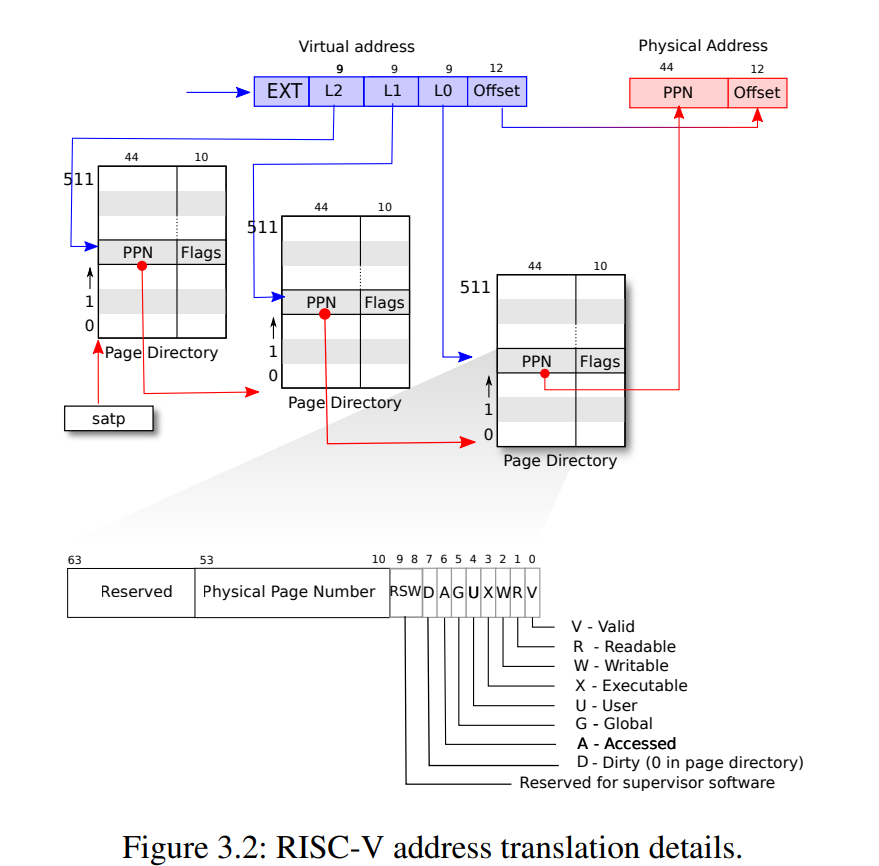

# 3.1 页式硬件

提醒一下，RISC-V指令（用户和内核指令都包括）使用的是虚拟地址。而机器的RAM或物理内存是由物理地址索引的。RISC-V页表硬件通过将每个虚拟地址映射到物理地址来为这两种地址建立联系。

XV6基于Sv39 RISC-V运行，这意味着它只使用64位虚拟地址的低39位；而高25位不使用。在这种Sv39配置中，RISC-V页表在逻辑上是一个由$$2^{27}$$（134,217,728）个页表条目（Page Table Entries/PTE）组成的数组。每个PTE包含一个44位的物理页码（Physical Page Number/PPN）和一些标志。页式硬件通过使用虚拟地址39位中的前27位索引页表，以找到该虚拟地址对应的一个PTE，然后生成一个56位的物理地址，其前44位来自PTE中的PPN，其后12位来自原始虚拟地址。图3.1显示了这个过程，页表的逻辑视图是一个简单的PTE数组（参见图3.2进行更详细的了解）。页表通过逻辑到物理地址的转换给了操作系统控制权，转换的粒度是一个个对齐的物理块（一个物理块包含$$2^{12}=4096$$字节），这样的块称为页面。

在Sv39 RISC-V中，虚拟地址的前25位不用于转换；将来RISC-V可能会使用那些位来定义更多级别的转换。另外物理地址也是有增长空间的： PTE格式中有空间让物理地址长度再增长10个比特位。

如图3.2所示，实际的转换分三个步骤进行。页表以三级的树型结构存储在物理内存中。该树的根是一个4096字节的页表页，其中包含512个PTE，其中包含该树下一级页表页的物理地址。这些页中的每一个都包含该树最后一级的512个PTE（也就是说每个PTE占8个字节，正如图3.2最下面所描绘的）。分页硬件使用27位中的前9位在根页表页面中选择PTE，中间9位在树的下一级页表页面中选择PTE，最后9位选择最终的PTE。

如果转换地址所需的三个PTE中的任何一个不存在，页式硬件就会引发页面故障异常，并让内核来处理该异常（参见第4章）。这种三级结构允许页表在大范围虚拟地址没有映射的情况下忽略整个页表页面。

每个PTE包含标志位，这些标志位告诉分页硬件允许如何使用关联的虚拟地址。`PTE_V`指示PTE是否存在：如果它没有被设置，对页面的引用会导致异常（即不允许）。`PTE_R`控制是否允许指令读取到页面。`PTE_W`控制是否允许指令写入到页面。`PTE_X`控制CPU是否可以将页面内容解释为指令并执行它们。`PTE_U`控制用户模式下的指令是否被允许访问页面；如果没有设置`PTE_U`，PTE只能在管理模式下使用。图3.2显示了它是如何工作的。标志和所有其他与页面硬件相关的结构在（***kernel/riscv.h***）中定义。

为了告诉硬件使用页表，内核必须将根页表页的物理地址写入到`satp`寄存器中（`satp`的作用是存放根页表页在物理内存中的地址）。每个CPU都有自己的`satp`。一个CPU将使用自己的`satp`指向的页表转换后续指令生成的所有地址。每个CPU都有自己的`satp`，这样不同的CPU就可以运行不同的进程，每个CPU都有自己的页表描述的私有地址空间。

关于术语的一些注意事项。物理内存是指DRAM中的存储单元。物理内存以一个字节为单位划为地址，称为物理地址。指令只使用虚拟地址，页式硬件将其转换为物理地址，然后将其发送到DRAM硬件来进行读写。与物理内存和虚拟地址不同，虚拟内存不是物理对象，而是指内核提供的管理物理内存和虚拟地址的抽象和机制的集合。