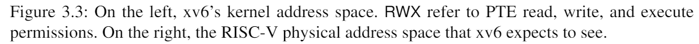

# 3.2 内核地址空间

Xv6为每个进程维护一个页表，用以描述每个进程的用户地址空间，外加一个单独描述内核地址空间的页表。内核配置其地址空间的布局，以允许自己以可预测的虚拟地址访问物理内存和各种硬件资源。图3.3显示了这种布局如何将内核虚拟地址映射到物理地址。文件(***kernel/memlayout.h***) 声明了xv6内核内存布局的常量。

QEMU模拟了一台计算机，它包括从物理地址`0x80000000`开始并至少到`0x86400000`结束的RAM（物理内存），xv6称结束地址为`PHYSTOP`。QEMU模拟还包括I/O设备，如磁盘接口。QEMU将设备接口作为内存映射控制寄存器暴露给软件，这些寄存器位于物理地址空间`0x80000000`以下。内核可以通过读取/写入这些特殊的物理地址与设备交互；这种读取和写入与设备硬件而不是RAM通信。第4章解释了xv6如何与设备进行交互。

内核使用“直接映射”获取内存和内存映射设备寄存器；也就是说，将资源映射到等于物理地址的虚拟地址。例如，内核本身在虚拟地址空间和物理内存中都位于`KERNBASE=0x80000000`。直接映射简化了读取或写入物理内存的内核代码。例如，当`fork`为子进程分配用户内存时，分配器返回该内存的物理地址；`fork`在将父进程的用户内存复制到子进程时直接将该地址用作虚拟地址。

有几个内核虚拟地址不是直接映射：

- 蹦床页面(trampoline page)。它映射在虚拟地址空间的顶部；用户页表具有相同的映射。第4章讨论了蹦床页面的作用，但我们在这里看到了一个有趣的页表用例；一个物理页面（持有蹦床代码）在内核的虚拟地址空间中映射了两次：一次在虚拟地址空间的顶部，一次直接映射。
- 内核栈页面。每个进程都有自己的内核栈，它将映射到偏高一些的地址，这样xv6在它之下就可以留下一个未映射的保护页(guard page)。保护页的PTE是无效的（也就是说`PTE_V`没有设置），所以如果内核溢出内核栈就会引发一个异常，内核触发`panic`。如果没有保护页，栈溢出将会覆盖其他内核内存，引发错误操作。恐慌崩溃（panic crash）是更可取的方案。*（注：Guard page不会浪费物理内存，它只是占据了虚拟地址空间的一段靠后的地址，但并不映射到物理地址空间。）*

虽然内核通过高地址内存映射使用内核栈，是它们也可以通过直接映射的地址进入内核。另一种设计可能只有直接映射，并在直接映射的地址使用栈。然而，在这种安排中，提供保护页将涉及取消映射虚拟地址，否则虚拟地址将引用物理内存，这将很难使用。

内核在权限`PTE_R`和`PTE_X`下映射蹦床页面和内核文本页面。内核从这些页面读取和执行指令。内核在权限`PTE_R`和`PTE_W`下映射其他页面，这样它就可以读写那些页面中的内存。对于保护页面的映射是无效的。
