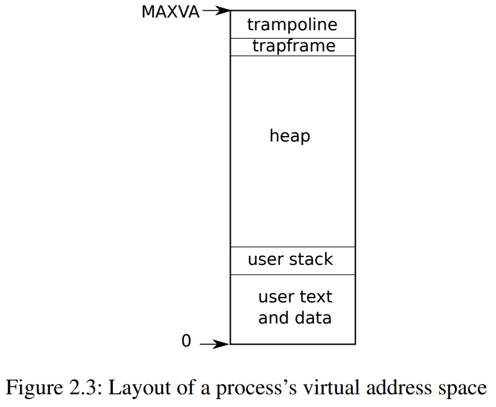

# 3.6 进程地址空间

每个进程都有一个单独的页表，当xv6在进程之间切换时，也会更改页表。如图2.3所示，一个进程的用户内存从虚拟地址零开始，可以增长到MAXVA (***kernel/riscv.h***:348)，原则上允许一个进程内存寻址空间为256G。

当进程向xv6请求更多的用户内存时，xv6首先使用`kalloc`来分配物理页面。然后，它将PTE添加到进程的页表中，指向新的物理页面。Xv6在这些PTE中设置`PTE_W`、`PTE_X`、`PTE_R`、`PTE_U`和`PTE_V`标志。大多数进程不使用整个用户地址空间；xv6在未使用的PTE中留空`PTE_V`。

我们在这里看到了一些使用页表的很好的例子。首先，不同进程的页表将用户地址转换为物理内存的不同页面，这样每个进程都拥有私有内存。第二，每个进程看到的自己的内存空间都是以0地址起始的连续虚拟地址，而进程的物理内存可以是非连续的。第三，内核在用户地址空间的顶部映射一个带有蹦床（trampoline）代码的页面，这样在所有地址空间都可以看到一个单独的物理内存页面。

图3.4更详细地显示了xv6中执行态进程的用户内存布局。栈是单独一个页面，显示的是由`exec`创建后的初始内容。包含命令行参数的字符串以及指向它们的指针数组位于栈的最顶部。再往下是允许程序在`main`处开始启动的值（即`main`的地址、`argc`、`argv`），这些值产生的效果就像刚刚调用了`main(argc, argv)`一样。

为了检测用户栈是否溢出了所分配栈内存，xv6在栈正下方放置了一个无效的保护页（guard page）。如果用户栈溢出并且进程试图使用栈下方的地址，那么由于映射无效（`PTE_V`为0）硬件将生成一个页面故障异常。当用户栈溢出时，实际的操作系统可能会自动为其分配更多内存。