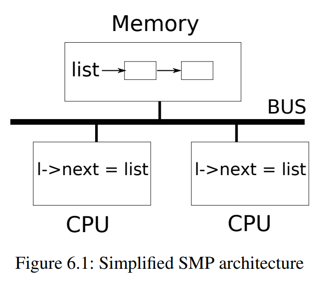
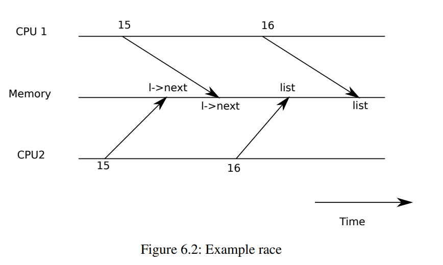

# 6.1 竞态条件

作为我们为什么需要锁的一个例子，考虑两个进程在两个不同的CPU上调用`wait`。`wait`释放了子进程的内存。因此，在每个CPU上，内核将调用`kfree`来释放子进程的页面。内核分配器维护一个链接列表：`kalloc()`(***kernel/kalloc.c***:69) 从空闲页面列表中取出（pop）一个内存页面；`kfree()`(***kernel/kalloc.c***:47) 将一个内存页面添加（push）到空闲列表上。为了获得最佳性能，我们可能希望两个父进程的`kfree`可以并行执行，而不必等待另一个进程，但是考虑到xv6的`kfree`实现，这将导致错误。



图6.1更详细地说明了这项设定：链表位于两个CPU共享的内存中，这两个CPU使用`load`和`store`指令操作链表。（实际上，每个处理器都有cache，但从概念上讲，多处理器系统的行为就像所有CPU共享一块单独的内存一样）如果没有并发请求，您可能以如下方式实现列表push操作：

```c
struct element {
    int data;
    struct element *next;
}; 

struct element *list = 0;

void 
push(int data)
{
    struct element *l;
    
    l = malloc(sizeof *l);
    l->data = data;
    l->next = list;
    list = l; 
}
```



如果存在隔离性，那么这个实现是正确的。但是，如果多个副本并发执行，代码就会出错。如果两个CPU同时执行`push`，如图6.1所示，两个CPU都可能在执行第16行之前执行第15行，这会导致如图6.2所示的不正确的结果。然后会有两个类型为`element`的列表元素使用`next`指针设置为`list`的前一个值。当两次执行位于第16行的对`list`的赋值时，第二次赋值将覆盖第一次赋值；第一次赋值中涉及的元素将丢失。

第16行丢失的更新是竞态条件（race condition）的一个例子。竞态条件是指多个进程读写某些共享数据（至少有一个访问是写入）的情况。竞争通常包含bug，要么丢失更新（如果访问是写入的），要么读取未完成更新的数据结构。竞争的结果取决于进程在处理器运行的确切时机以及内存系统如何排序它们的内存操作，这可能会使竞争引起的错误难以复现和调试。例如，在调试`push`时添加`printf`语句可能会改变执行的时间，从而使竞争消失。

避免竞争的通常方法是使用锁。锁确保互斥，这样一次只有一个CPU可以执行`push`中敏感的代码行；这使得上述情况不可能发生。上面代码的正确上锁版本只添加了几行（用黄色突出显示）：

```c
struct element {
    int data;
    struct element *next;
}; 

struct element *list = 0;
struct lock listlock;

void 
push(int data)
{
    struct element *l;
    
    l = malloc(sizeof *l);
    l->data = data;
    acquire(&listlock);
    l->next = list;
    list = l; 
    release(&listlock);
}
```

`acquire`和`release`之间的指令序列通常被称为临界区域（critical section）。锁的作用通常被称为保护`list`。

当我们说锁保护数据时，我们实际上是指锁保护适用于数据的某些不变量集合。不变量是跨操作维护的数据结构的属性。通常，操作的正确行为取决于操作开始时不变量是否为真。操作可能暂时违反不变量，但必须在完成之前重新建立它们。例如，在链表的例子中，不变量是`list`指向列表中的第一个元素，以及每个元素的`next`字段指向下一个元素。`push`的实现暂时违反了这个不变量：在第17行，`l->next`指向`list`（注：则此时`list`不再指向列表中的第一个元素，即违反了不变量），但是`list`还没有指向`l`（在第18行重新建立）。我们上面检查的竞态条件发生了，因为第二个CPU执行了依赖于列表不变量的代码，而这些代码（暂时）被违反了。正确使用锁可以确保每次只有一个CPU可以对临界区域中的数据结构进行操作，因此当数据结构的不变量不成立时，将没有其他CPU对数据结构执行操作。

您可以将锁视为串行化（serializing）并发的临界区域，以便同时只有一个进程在运行这部分代码，从而维护不变量（假设临界区域设定了正确的隔离性）。您还可以将由同一锁保护的临界区域视为彼此之间的原子，即彼此之间只能看到之前临界区域的完整更改集，而永远看不到部分完成的更新。

尽管正确使用锁可以改正不正确的代码，但锁限制了性能。例如，如果两个进程并发调用`kfree`，锁将串行化这两个调用，我们在不同的CPU上运行它们没有任何好处。如果多个进程同时想要相同的锁或者锁经历了争用，则称之为发生冲突（conflict）。内核设计中的一个主要挑战是避免锁争用。Xv6为此几乎没做任何工作，但是复杂的内核会精心设计数据结构和算法来避免锁的争用。在链表示例中，内核可能会为每个CPU维护一个空闲列表，并且只有当CPU的列表为空并且必须从另一个CPU挪用内存时才会触及另一个CPU的空闲列表。其他用例可能需要更复杂的设计。

锁的位置对性能也很重要。例如，在`push`中把`acquire`的位置提前也是正确的：将`acquire`移动到第13行之前完全没问题。但这样对`malloc`的调用也会被串行化，从而降低了性能。下面的《使用锁》一节提供了一些关于在哪里插入`acquire`和`release`调用的指导方针。