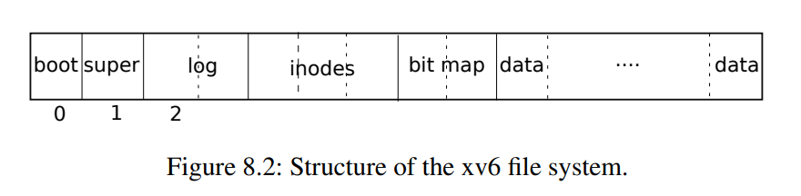

# 8.1 概述

xv6文件系统实现分为七层，如图8.1所示。磁盘层读取和写入virtio硬盘上的块。缓冲区高速缓存层缓存磁盘块并同步对它们的访问，确保每次只有一个内核进程可以修改存储在任何特定块中的数据。日志记录层允许更高层在一次事务（transaction）中将更新包装到多个块，并确保在遇到崩溃时自动更新这些块（即，所有块都已更新或无更新）。索引结点层提供单独的文件，每个文件表示为一个索引结点，其中包含唯一的索引号（i-number）和一些保存文件数据的块。目录层将每个目录实现为一种特殊的索引结点，其内容是一系列目录项，每个目录项包含一个文件名和索引号。路径名层提供了分层路径名，如***/usr/rtm/xv6/fs.c***，并通过递归查找来解析它们。文件描述符层使用文件系统接口抽象了许多Unix资源（例如，管道、设备、文件等），简化了应用程序员的工作。

| 文件描述符（File descriptor）  |
| ------------------------------ |
| 路径名（Pathname）             |
| 目录（Directory）              |
| 索引结点（Inode）              |
| 日志（Logging）                |
| 缓冲区高速缓存（Buffer cache） |
| 磁盘（Disk）                   |

​                    图8.1 XV6文件系统的层级

文件系统必须有将索引节点和内容块存储在磁盘上哪些位置的方案。为此，xv6将磁盘划分为几个部分，如图8.2所示。文件系统不使用块0（它保存引导扇区）。块1称为超级块：它包含有关文件系统的元数据（文件系统大小（以块为单位）、数据块数、索引节点数和日志中的块数）。从2开始的块保存日志。日志之后是索引节点，每个块有多个索引节点。然后是位图块，跟踪正在使用的数据块。其余的块是数据块：每个都要么在位图块中标记为空闲，要么保存文件或目录的内容。超级块由一个名为`mkfs`的单独的程序填充，该程序构建初始文件系统。

本章的其余部分将从缓冲区高速缓存层开始讨论每一层。注意那些在较低层次上精心选择的抽象可以简化较高层次的设计的情况。