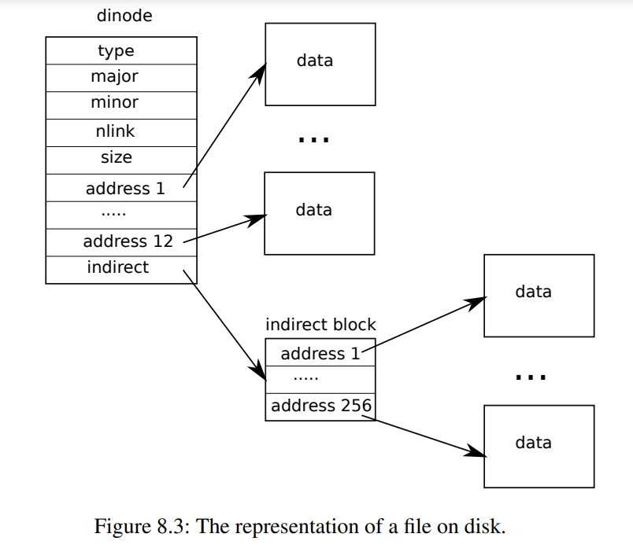

# 8.10 代码： Inode包含内容

磁盘上的inode结构体`struct dinode`包含一个`size`和一个块号数组（见图8.3）。inode数据可以在`dinode`的`addrs`数组列出的块中找到。前面的`NDIRECT`个数据块被列在数组中的前`NDIRECT`个元素中；这些块称为直接块（direct blocks）。接下来的`NINDIRECT`个数据块不在inode中列出，而是在称为间接块（indirect block）的数据块中列出。`addrs`数组中的最后一个元素给出了间接块的地址。因此，可以从inode中列出的块加载文件的前12 kB（`NDIRECT x BSIZE`）字节，而只有在查阅间接块后才能加载下一个256 kB（`NINDIRECT  x BSIZE`）字节。这是一个很好的磁盘表示，但对于客户端来说较复杂。函数`bmap`管理这种表示，以便实现我们将很快看到的如`readi`和`writei`这样的更高级例程。`bmap(struct inode *ip, uint bn)`返回索引结点`ip`的第`bn`个数据块的磁盘块号。如果`ip`还没有这样的块，`bmap`会分配一个。

函数`bmap`（***kernel/fs.c***:378）从简单的情况开始：前面的`NDIRECT`个块在inode本身中列出（***kernel/fs.c***:383-387）中。下面`NINDIRECT`个块在`ip->addrs[NDIRECT]`的间接块中列出。`Bmap`读取间接块（***kernel/fs.c***:394），然后从块内的正确位置（***kernel/fs.c***:395）读取块号。如果块号超过`NDIRECT+NINDIRECT`，则`bmap`调用`panic`崩溃；`writei`包含防止这种情况发生的检查（***kernel/fs.c***:490）。

`Bmap`根据需要分配块。`ip->addrs[]`或间接块中条目为零表示未分配块。当`bmap`遇到零时，它会用按需分配的新块（***kernel/fs.c***:384-385）（***kernel/fs.c***:392-393）替换它们。

`itrunc`释放文件的块，将inode的`size`重置为零。`Itrunc`（***kernel/fs.c***:410）首先释放直接块（***kernel/fs.c***:416-421），然后释放间接块中列出的块（***kernel/fs.c***:426-429），最后释放间接块本身（***kernel/fs.c***:431-432）。

`Bmap`使`readi`和`writei`很容易获取inode的数据。`Readi`（***kernel/fs.c***:456）首先确保偏移量和计数不超过文件的末尾。开始于超过文件末尾的地方读取将返回错误（***kernel/fs.c***:461-462），而从文件末尾开始或穿过文件末尾的读取返回的字节数少于请求的字节数（***kernel/fs.c***:463-464）。主循环处理文件的每个块，将数据从缓冲区复制到`dst`（***kernel/fs.c***:466-474）。`writei`（***kernel/fs.c***:483）与`readi`相同，但有三个例外：从文件末尾开始或穿过文件末尾的写操作会使文件增长到最大文件大小（***kernel/fs.c***:490-491）；循环将数据复制到缓冲区而不是输出（kernel/fs.c:36）；如果写入扩展了文件，`writei`必须更新其大小（***kernel/fs.c***:504-511）。

`readi`和`writei`都是从检查`ip->type == T_DEV`开始的。这种情况处理的是数据不在文件系统中的特殊设备；我们将在文件描述符层返回到这种情况。

函数`stati`（***kernel/fs.c***:442）将inode元数据复制到`stat`结构体中，该结构通过`stat`系统调用向用户程序公开。